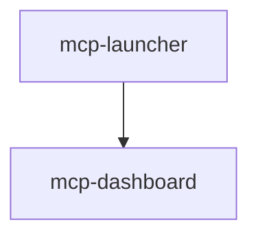

# mcp-dashboard

## Overview

**Domain**: mcp
**Owner**: @platform-team
**Version**: 0.1.0
**Status**: development
**Data Classification**: internal

## Inputs/Outputs

### Inputs
- pattern_events
- mcp_metrics
- server_status

### Outputs
- dashboard_ui
- real_time_visualizations
- alert_notifications

## Dependencies

### Direct Dependencies
- mcp-launcher

## Dependency Graph

## Metrics

- **Namespace**: mcp_dashboard
- **Port**: 9101
- **Endpoint**: http://localhost:9101/metrics

## Tags

`ui` `monitoring` `v0.1` `real-time`

---
*Generated by CIA Registry*
