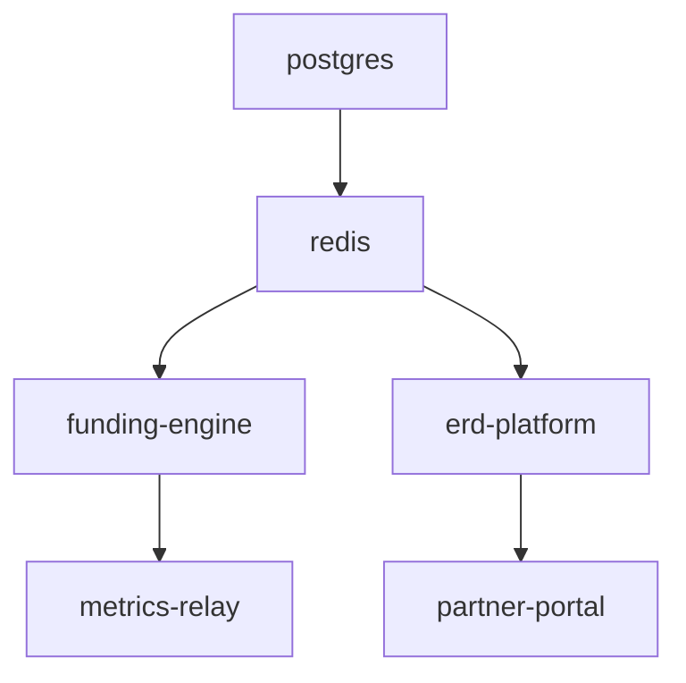

# Recovery Compass Service Contracts

## Service Port Allocations

| Service | Internal Port | External Port | Protocol |
|---------|--------------|---------------|----------|
| funding-engine | 8000 | - | HTTP |
| erd-platform | 3000 | 3000 | HTTP |
| metrics-relay | 9090 | - | HTTP |
| partner-portal | 80 | 8080 | HTTP |
| postgres | 5432 | - | TCP |
| redis | 6379 | - | TCP |

## Health Check Endpoints

### funding-engine (Port 8000)
- **Endpoint**: `GET /health`
- **Success**: HTTP 200 with JSON `{"status": "healthy", "service": "funding-engine"}`
- **Timeout**: 10s
- **Interval**: 30s
- **Retries**: 3

### erd-platform (Port 3000)
- **Endpoint**: `GET /api/health`
- **Success**: HTTP 200 with JSON `{"status": "ok", "database": "connected"}`
- **Timeout**: 10s
- **Interval**: 30s
- **Retries**: 3

### metrics-relay (Port 9090)
- **Endpoint**: `GET /metrics/health`
- **Success**: HTTP 200 with plain text `OK`
- **Timeout**: 5s
- **Interval**: 20s
- **Retries**: 3

### partner-portal (Port 80)
- **Endpoint**: `GET /`
- **Success**: HTTP 200
- **Timeout**: 5s
- **Interval**: 30s
- **Retries**: 3

### postgres (Port 5432)
- **Check**: `pg_isready -U ${POSTGRES_USER}`
- **Timeout**: 5s
- **Interval**: 10s
- **Retries**: 5

### redis (Port 6379)
- **Check**: `redis-cli ping`
- **Success**: `PONG`
- **Timeout**: 5s
- **Interval**: 10s
- **Retries**: 5

## Environment Variable Contracts

### funding-engine
```bash
# Required
AIRTABLE_API_KEY=              # Airtable access key
AIRTABLE_BASE_ID=              # Airtable base identifier
PERPLEXITY_API_KEY=            # Perplexity AI key
CHARITY_NAVIGATOR_API_KEY=     # Charity Navigator API key (NEW!)
CHARITY_NAVIGATOR_APP_ID=      # Charity Navigator App ID (NEW!)
DATABASE_URL=                  # PostgreSQL connection string
REDIS_URL=                     # Redis connection string

# Optional
LOG_LEVEL=info                 # debug|info|warn|error
PORT=8000                      # Service port
WORKER_THREADS=4               # Concurrent workers
CACHE_TTL=3600                 # Cache time-to-live (seconds)
```

### erd-platform
```bash
# Required
NODE_ENV=                      # development|production
DATABASE_URL=                  # PostgreSQL connection string
REDIS_URL=                     # Redis connection string
JWT_SECRET=                    # JWT signing secret
API_BASE=                      # Base URL for APIs

# Optional
PORT=3000                      # Service port
SESSION_SECRET=                # Session encryption key
CORS_ORIGINS=*                 # CORS allowed origins
RATE_LIMIT=100                 # Requests per minute
```

### metrics-relay
```bash
# Required
DATABASE_URL=                  # PostgreSQL connection string
METRICS_CONFIG_PATH=           # Path to metrics.yml

# Optional
PORT=9090                      # Service port
COLLECTION_INTERVAL=60         # Metrics collection interval (seconds)
RETENTION_DAYS=90              # Data retention period
EXPORT_FORMAT=json             # json|prometheus
```

### partner-portal
```bash
# Required
REACT_APP_API_URL=             # ERD platform API URL
REACT_APP_METRICS_URL=         # Metrics relay URL

# Optional
REACT_APP_THEME=light          # light|dark
REACT_APP_FEATURES=all         # Feature flags
PUBLIC_URL=/                   # Base path for assets
```

### postgres
```bash
# Required
POSTGRES_DB=recovery_compass   # Database name
POSTGRES_USER=                 # Database user
POSTGRES_PASSWORD=             # Database password

# Optional
POSTGRES_HOST_AUTH_METHOD=md5  # Authentication method
POSTGRES_INITDB_ARGS=         # Additional init arguments
```

### redis
```bash
# Optional
REDIS_PASSWORD=                # Redis password (if auth enabled)
REDIS_DATABASES=16             # Number of databases
REDIS_MAXMEMORY=256mb         # Memory limit
REDIS_MAXMEMORY_POLICY=allkeys-lru  # Eviction policy
```

## Inter-Service Communication

### Network Topology
```
┌─────────────────┐     ┌─────────────────┐
│ partner-portal  │────▶│  erd-platform   │
└─────────────────┘     └────────┬────────┘
                                 │
                                 ▼
┌─────────────────┐     ┌─────────────────┐
│ funding-engine  │────▶│    postgres     │
└─────────────────┘     └─────────────────┘
         │                       ▲
         │                       │
         ▼                       │
┌─────────────────┐     ┌─────────────────┐
│ metrics-relay   │────▶│      redis      │
└─────────────────┘     └─────────────────┘
```

### API Contracts

#### funding-engine → postgres
- Connection: Direct via `DATABASE_URL`
- Schema: `funding` schema
- Tables: `opportunities`, `applications`, `sync_logs`

#### erd-platform → postgres
- Connection: Direct via `DATABASE_URL`
- Schema: `erd` schema
- Tables: `users`, `assessments`, `outcomes`

#### metrics-relay → redis
- Connection: Direct via `REDIS_URL`
- Keys: `metrics:*`, `cache:*`
- TTL: 3600 seconds default

#### partner-portal → erd-platform
- Protocol: HTTP REST
- Base: `http://erd-platform:3000/api`
- Auth: JWT Bearer tokens

## Volume Mounts

| Service | Volume | Mount Path | Purpose |
|---------|--------|------------|---------|
| funding-engine | funding-data | /data | Persistent storage |
| funding-engine | scripts | /app/scripts | Shared scripts (read-only) |
| erd-platform | erd-data | /app/data | Application data |
| metrics-relay | metrics-data | /metrics | Metrics storage |
| metrics-relay | config | /app/config | Configuration (read-only) |
| postgres | postgres-data | /var/lib/postgresql/data | Database files |
| redis | redis-data | /data | Cache persistence |

## Security Boundaries

### External Access
- Only `erd-platform` (3000) and `partner-portal` (8080) exposed
- All other services internal-only
- Use reverse proxy for production

### Network Isolation
- `core-net`: All services
- `external-apis`: funding-engine only
- `partner-access`: partner-portal only
- `monitoring`: metrics-relay only

## Startup Dependencies



## Agreement Status

- [ ] Funding team approval
- [ ] ERD platform team approval
- [ ] DevOps approval
- [ ] Security review
- [ ] Final sign-off

*Document created: July 30, 2025*
*Next review: Before implementation*
